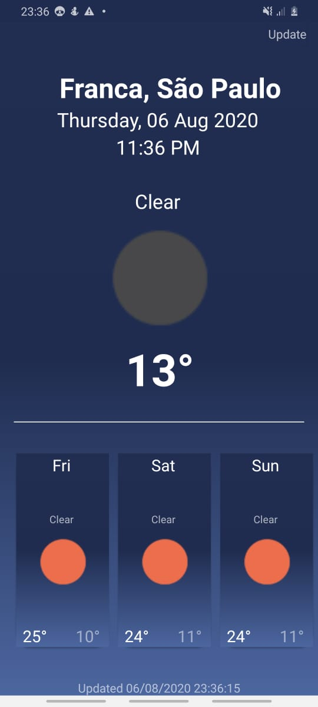

<h1 align="center">
 
  
 
 
</h1>

  
  

<!-- What is: -->

## What is Forecast App?

Forecast-app is an application to check the weather forecast at your current location.
I'm sorry for the video quality :D

<!-- Tecnologics: -->

## Technologies Used?

- _React-native:_ - Framework used in application development.
- _Redux:_ Library used to control application status.
- _Axios:_ Http client based on promises for connection with api.
- _Eslint:_ Code analysis tool keeping the standards configured for application.
- _Moment:_ Parse, validate, manipulate, and display dates and times in JavaScript.

<!-- Links: -->

## Links

_React-native:_ (https://facebook.github.io/react-native/)

- _Redux:_ (https://redux.js.org/)
- _Axios:_ (https://github.com/axios/axios)
- _Eslint:_ (https://eslint.org/)
- _Moment:_ (https://momentjs.com/)

---

<!-- Get Started / Install: -->

## Getting started

Prerequisites: To run the react-native project on your mobile or emulator you need some
more specific settings, I recommend this link
(https://facebook.github.io/react-native/docs/getting-started) if you do not already have the recommended settings on your machine.

1. Install
   [Git](http://git-scm.com/downloads) e
   [NodeJS](http://nodejs.org/download/),
   in case you don't have them yet.

2. Clone repository:

   sh
   \$ git clone git://github.com/passeto/forecastApp.git

3) Go to project folder:

   sh
   \$ cd forecastApp

4. Install all dependences:

   sh
   \$ npm install ou yarn

5) Finally run:

   sh
   $ react-native run-android (Android) or npx react-native run-android
   ou
   $ react-native run-ios (IOS) or npx react-native run-ios

Now you will see the app running on your mobile phone or emulator.
remember to enable the location of your smartphone :D

<!-- Create by: -->

## Who's behind this?

Developer passionate about programming and technologies.

_Create by_:

- [Luccas Passeto](http://github.com/passeto)
